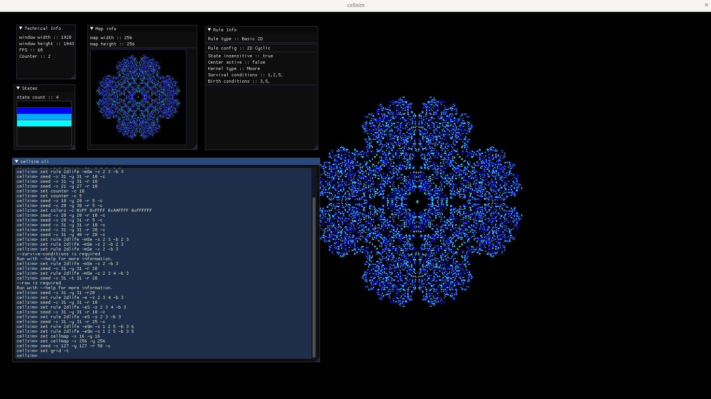

[](https://github.com/JungerBoyo/CellSimRemake/actions/workflows/ci.yml)
[](https://codecov.io/gh/JungerBoyo/CellSimRemake)

# CellSim 
## Brief
App is able to carry out simulations of popular cellular automatas rules e.g. the ones from CA rules lexicon
http://www.mirekw.com/ca/ca_rules.html. App is based on builtin CLI emulator implemented using ImGui library.
Rule algorithms are implemented in OpenGL GLSL compute shaders. 



## How to use 
To use, download release for your machine and run. If you want to build from source make sure you have `conan`
package manager, `CMake`, `make`/`ninja`, `spirv-tools`, `glslangValidator` installed. To build in release mode 
configure CMake: 

`cmake -S . -B build/ -DCMAKE_BUILD_TYPE=Release`

To enable GLFW3, OpenGL debugging add options:
* `-DGL_DEBUG_ENABLE=ON` 
* `-DGLFW_DEBUG_ENABLE=ON`

## Defining new rules
To define rule app uses 2 classes: 
* `Rule` class
    > Defines rule's step loop which includes calling glDispatchCompute (See `BASIC_1D` and `BASIC_2D` rules for examples), 
     using `void step(...)` interface method. It should bind to compatible `RuleConfigs`, which means ones that use
     `step algorithm` complying with `Rule's step procedure`. Rule defines BaseConfig struct that is meant to be
     used inside algorithm compute shaders:
    ```
      struct BaseConfig {
        Vec2<std::int32_t> map_resolution; // current map res
        std::int32_t state_count;          // number of states/colors
        std::int32_t iteration;            // current iteration
      };
     ```
* `RuleConfig` class
    > Defines rule's `configuration arguments`/`Config` the size of which is retrieved using overridden `data()` and `size()`
      methods. If you want your config data to be displayed in Rule info window override `ruleConfigName()` and
      `configSerialized()` methods. The main thing that you have to define is compute shader complying with defined Rule.
      Inside of your compute shader apart from BaseConfig you can use.
        
    * `Config (UBO)` defined inside of RuleConfig, config has to comply with GLSL std140 alignment rules.
    * `StateMap (SSBO)` defined inside cellmap which is the array of cell states that you can read and write
    * `Whatever` you will define in `Rule` but you will need to take care of binding necessary buffer to appropriate
        locations. To see reserved binding locations check `shaders/shconfig.hpp` header. You can't use plain uniforms
        due to `GL_ARB_gl_spirv` OpenGL extension used by CellSim. 
  > To include your shader for cmake shader compilation
        modify `Makefile`/`build.ninja` following the same pattern that other app predefined shaders are defined with.
* `CellSimCliEmulator` class
    > define your new rule options in anonymous struct defined in `CellSimCliEmulator` class. Then go to `setCLI()` 
      method and add new rule options to `CLI11 App parser` the same way the app predefined rules are added.

* `App` class
    > in app class add new branch in `parseCommand()` implementation under `if(... .subcmd_rule->parsed())` branch
      in which you create corresponding rule config instance and set it using `updateRuleConfig(...)` method. To optimize
      and avoid `Rule` recreation pass appropriate `RuleType` enum value.
        